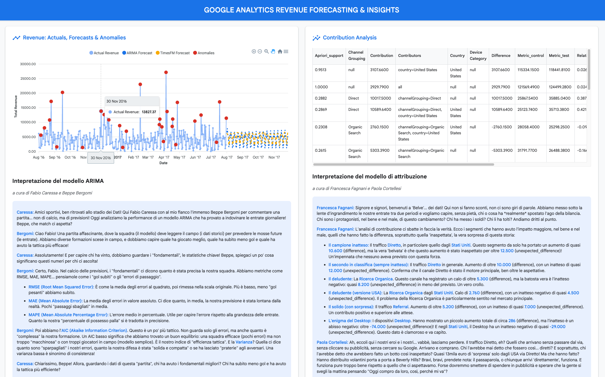

## BQML + LLM Forecasting & Interpretation Demo 

This application demonstrates using BigQuery ML (BQML) for time series forecasting (ARIMA & TimesFM) on Google Analytics data, generating interpretations of model results using the Gemini API via Vertex AI, and displaying everything in a Flask web application deployed to Google App Engine. A key feature is the use of a Large Language Model (LLM) to provide natural language explanations and commentary on the ARIMA model evaluation and contribution analysis insights.

[Demo Video](https://youtu.be/99nFCfCv5s8)

### Prerequisites

1.  **Google Cloud Project:** You need a Google Cloud project with billing enabled.
2.  **gcloud CLI:** Install and initialize the [Google Cloud CLI](https://cloud.google.com/sdk/docs/install).
3.  **Python & Pip:** Ensure you have Python 3.9+ and pip installed.
4.  **Git:** To clone the repository.


### Setup Instructions

1.  **Clone the Repository:**
    ```bash
    git clone <your-repo-url>
    cd <repository-directory> # Navigate to the directory containing app.py, etc.
    ```

2.  **Enable APIs:** Enable the necessary Google Cloud APIs for your project. You can do this via the Cloud Console or `gcloud`:
    ```bash
    gcloud services enable bigquery.googleapis.com \
        aiplatform.googleapis.com \
        appengine.googleapis.com \
        appengineflex.googleapis.com # Often needed for App Engine admin tasks
    ```

3.  **Create BigQuery Dataset:** Create a BigQuery dataset where the BQML models and results tables will be stored.
    ```bash
    bq mk --dataset YOUR_GCP_PROJECT_ID:YOUR_BQ_DATASET_ID
    ```
    Replace `YOUR_GCP_PROJECT_ID` with your project ID and `YOUR_BQ_DATASET_ID` with your desired dataset name (e.g., `bqml_llm_demo`).

4.  **Run the BQML SQL Script:** Execute the `arima_forecasting.sql` script to create the necessary views, models, and results tables. Pass your project and dataset IDs as parameters.
    ```bash
    bq query --use_legacy_sql=false \
             --parameter='project_id:STRING:YOUR_GCP_PROJECT_ID' \
             --parameter='dataset_id:STRING:YOUR_BQ_DATASET_ID' \
             < arima_forecasting.sql
    ```
    *(Alternatively, open the script in the BigQuery Console, declare the variables at the top, and run it.)*

5.  **Configure `app.yaml`:**
    *   Open the `app.yaml` file.
    *   Replace `YOUR_APP_ENGINE_SERVICE_NAME` with a unique name for your App Engine service (e.g., `bqml-llm-demo`).
    *   Replace `YOUR_APP_ENGINE_SERVICE_ACCOUNT_EMAIL` with the email of the service account App Engine should use. You can use the default App Engine service account (`YOUR_GCP_PROJECT_ID@appspot.gserviceaccount.com`) or create a dedicated one.
    *   Replace `YOUR_BIGQUERY_DATASET` under `env_variables` with the dataset ID you created in step 3.

6.  **Configure Service Account Permissions:** Ensure the service account specified in `app.yaml` has the following IAM roles in your project:
    *   `roles/bigquery.dataViewer` (BigQuery Data Viewer)
    *   `roles/bigquery.user` (BigQuery User)
    *   `roles/aiplatform.user` (Vertex AI User)
    *(If using the default App Engine SA, you might need to add these roles.)*

7.  **Install Python Dependencies:**
    ```bash
    pip install -r requirements.txt
    ```

8.  **Deploy to App Engine:**
    ```bash
    gcloud app deploy app.yaml --project YOUR_GCP_PROJECT_ID
    ```
    Follow the prompts. Deployment might take a few minutes.

9. **Access the Application:** Once deployed, `gcloud` will output the URL for your service (usually `https://YOUR_APP_ENGINE_SERVICE_NAME-dot-YOUR_GCP_PROJECT_ID.lm.r.appspot.com`). Access this URL in your browser.
